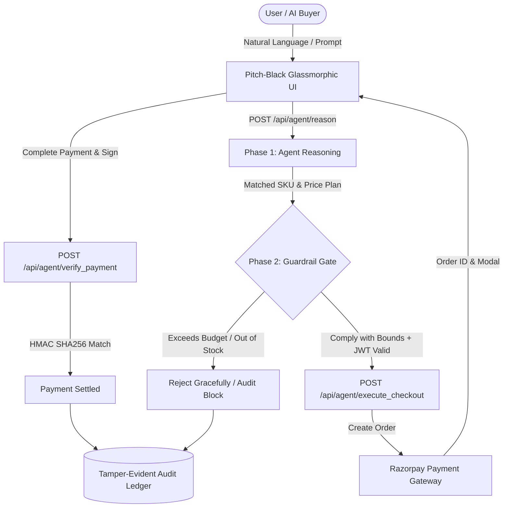

# ⚡ Razorpay Agentic Commerce Gateway

> **Autonomous 2-Phase AI Commerce Engine with Strict Safety Guardrails, JWT Authentication, Machine-to-Machine (A2A) Protocol, and Real-Time Audit Ledger.**

[](https://fastapi.tiangolo.com)
[](https://python.org)
[](https://razorpay.com)
[](LICENSE)

---

## 🌟 Overview

The **Razorpay Agentic Commerce Gateway** bridges autonomous AI agents and secure financial settlements. It allows conversational agents and machine buyers (A2A) to autonomously discover products, formulate checkout intents, and execute payments via Razorpay — protected at every step by deterministic security boundaries and runtime guardrails.

### 🛡️ Why Guardrails Matter in Agentic Commerce
Autonomous AI agents can hallucinate or exceed budgetary limits if given direct access to transaction tools. This gateway enforces a **Two-Phase Bounded Tool-Calling Pattern**:
1. **Phase 1 (Reasoning / Planning):** The agent parses natural language, matches verified catalog SKUs, calculates prices, and presents a structured execution plan.
2. **Phase 2 (Deterministic Execution Gate):** Strict Pydantic schemas, session budget thresholds (e.g. ₹5,000 max), dynamic stock checks, and JWT authentication validate the payload before a Razorpay order can be initialized.
3. **Phase 3 (Settlement & Cryptographic Verification):** Payment signatures (`razorpay_signature`) are validated via HMAC SHA-256 and immutably recorded in the audit ledger.

---

## 🏗️ Architecture & Flow



---

## ✨ Key Features

- **🔒 Two-Phase Autonomous Checkout:** Strict separation of LLM intent reasoning and transactional tool execution.
- **🛡️ Multi-Layered Safety Guardrails:**
  - Hard session spend limits (configurable in real-time).
  - Dynamic inventory stock verification with explainable fallback remedies.
  - Strict Pydantic schema validation preventing negative/zero amount injections.
- **🔑 Secure Authentication (JWT + PBKDF2):**
  - Robust regex validation for usernames and passwords.
  - PBKDF2 with SHA-256 password hashing with salt.
  - Bearer token authorization required on all execution endpoints.
- **🤖 Machine-to-Machine (A2A) Protocol:**
  - Standardized Agent Commerce Protocol (`ACP/2.0-Razorpay-UAP`) manifest.
  - Machine-consumable autonomous agent checkout (`/api/v1/protocol/a2a_checkout`).
- **📊 Real-Time Telemetry & Audit Ledger:**
  - Every agent thought, guardrail evaluation, checkout attempt, and settlement is logged.
  - Live dashboard with GMV counters, intercepted blocks, and audit trail exports.
- **🎨 Glassmorphic Interface:**
  - Pitch-black cyber-themed frontend with animated ambient glows and dynamic state orbs.
  - Integrated product cards, upsell suggestions, and live configuration drawer.

---

## 📁 Repository Structure

```
d:\Razorpay/
├── backend/
│   ├── config.py              # Environment variables & default guardrail constants
│   ├── catalog.py             # Verified product catalog, add-ons & upsell engine
│   └── main.py                # FastAPI app, JWT auth, guardrails, Razorpay client & routes
├── frontend/
│   ├── index.html             # Single-page glassmorphic application UI
│   ├── styles.css             # Pitch-black CSS design system & micro-animations
│   └── app.js                 # Frontend orchestration, chat agent, & Razorpay checkout
├── login/                     # React / Vite Auth Screen source & build
├── signup/                    # React / Vite Signup Screen source & build
├── run.py                     # Unified launcher script (Starts backend on :8000)
├── test_agentic_flow.py       # End-to-end automated test suite for all agentic flows
└── README.md                  # Project documentation
```

---

## 🚀 Quick Start

### 1. Prerequisites
- **Python 3.10+**
- **pip** package manager

### 2. Installation

Clone or navigate to the workspace root:
```bash
cd d:\Razorpay
```

Install the required Python dependencies:
```bash
pip install fastapi uvicorn pydantic python-dotenv razorpay requests
```

### 3. Environment Variables (Optional)
Create a `.env` file in the root directory if you want to use live Razorpay test keys:
```env
RAZORPAY_KEY_ID=rzp_test_YourKeyHere
RAZORPAY_KEY_SECRET=YourKeySecretHere
JWT_SECRET_KEY=your-super-secret-jwt-signing-key
```
*(Note: If omitted, the gateway defaults to a built-in sandbox mock mode that safely simulates payments and order generation.)*

### 4. Run the Server
Launch the unified server:
```bash
python run.py
```
The application will be accessible at:
- **Web Interface:** [http://127.0.0.1:8000](http://127.0.0.1:8000)
- **Interactive Swagger Docs:** [http://127.0.0.1:8000/docs](http://127.0.0.1:8000/docs)
- **Agent Manifest:** [http://127.0.0.1:8000/api/v1/protocol/agent_manifest](http://127.0.0.1:8000/api/v1/protocol/agent_manifest)

### 5. Default Demo Credentials
- **Username:** `demo_user`
- **Password:** `Demo@12345`

*(You can also register a new account anytime via the UI or `/api/auth/register`)*.

---

## 🧪 Running the Test Suite

A comprehensive test suite is included to verify all guardrail layers, authentication rules, A2A protocols, and payment verification pipelines:

```bash
python test_agentic_flow.py
```

### Test Coverage Highlights:
1. **Catalog API:** Verifies stock flags and price consistency.
2. **Auth Guardrails:** Tests regex constraints for weak passwords and invalid usernames.
3. **JWT Authentication:** Tests login, token generation, and `/api/auth/me` verification.
4. **401 Rejection:** Ensures unauthorized users cannot execute autonomous orders.
5. **Phase 1 Reasoning:** Verifies natural language parsing and intent identification.
6. **Phase 2 Budget Interception:** Verifies that items exceeding ₹5,000 (e.g. Enterprise License) are strictly blocked by Pydantic validators.
7. **Inventory Gate:** Verifies graceful handling of out-of-stock SKUs.
8. **A2A Autonomous Checkout:** Verifies machine buyer protocol settlements.
9. **HMAC Payment Verification:** Verifies settlement cryptographic signature checks and audit logging.

---

## 📡 API Reference Summary

| Method | Endpoint | Description | Auth Required |
| :--- | :--- | :--- | :--- |
| `POST` | `/api/auth/register` | Register a new user with schema validation | No |
| `POST` | `/api/auth/login` | Authenticate and obtain JWT access token | No |
| `GET` | `/api/auth/me` | Fetch authenticated user profile | **Yes (Bearer)** |
| `GET` | `/api/catalog` | Get verified product catalog & active guardrails | No |
| `POST` | `/api/agent/reason` | **Phase 1:** Analyze user intent & formulate plan | No |
| `POST` | `/api/agent/execute_checkout` | **Phase 2:** Validate bounds & initialize Razorpay order | **Yes (Bearer)** |
| `POST` | `/api/agent/verify_payment` | **Phase 3:** Verify payment signature & settle order | No |
| `GET` | `/api/v1/protocol/agent_manifest` | ACP/2.0 Machine-readable Agent Manifest | No |
| `POST` | `/api/v1/protocol/a2a_checkout` | Autonomous A2A Machine Buyer Checkout | No |
| `GET` | `/api/agent/audit_trail` | Retrieve immutable audit ledger | No |
| `POST` | `/api/agent/update_config` | Update session limit threshold & gateway keys | No |
| `GET` | `/api/agent/stats` | Live GMV, order volume, & guardrail metrics | No |

---

## 💡 Example Prompt Scenarios to Try in UI

- **Standard Purchase:**  
  *"I want to buy the Autonomous Commerce Pro Tier"* → *Agent initiates Phase 1 reasoning, displays upsell, and transitions to Razorpay checkout.*
- **Guardrail Interception:**  
  *"Buy the Enterprise License"* → *Agent warns and blocks execution because ₹49,999 exceeds the ₹5,000 threshold.*
- **Out of Stock Fallback:**  
  *"Order the H100 GPU Cluster Instant Node"* → *Agent intercepts out-of-stock SKU and suggests in-stock alternatives.*
- **General Inquiries:**  
  *"What can I buy?"* or *"Show catalog"* → *Agent lists available catalog items without initiating checkout.*

---

## 📄 License
MIT License. Built for agentic commerce research and demonstration.
